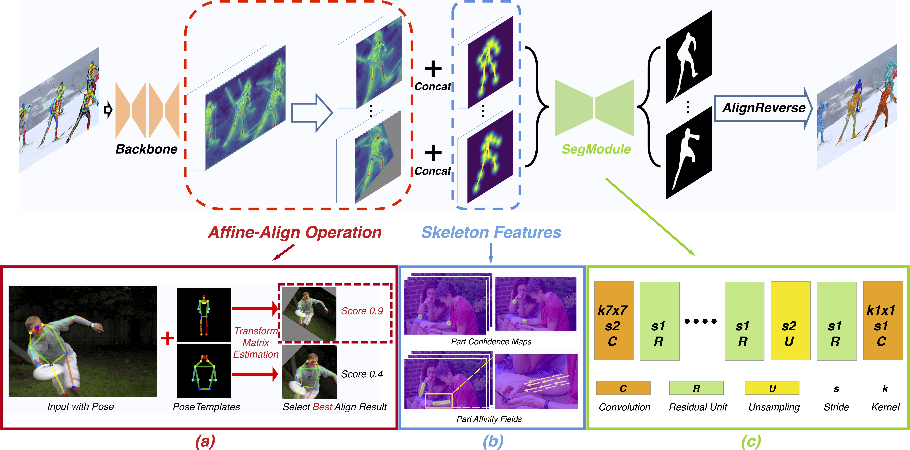

# Pose2Seg

*Official* code for the paper "Pose2Seg: Detection Free Human Instance Segmentation"[[ProjectPage]](http://www.liruilong.cn/Pose2Seg/index.html)[[arXiv]](https://arxiv.org/abs/1803.10683) @ CVPR2019.

The *OCHuman dataset* proposed in our paper is released [here](https://github.com/liruilong940607/OCHumanApi)

<div align="center">

<p> Pipeline of our pose-based instance segmentation framework.</p>
</div>


## Setup environment

``` bash
pip install cython matplotlib tqdm opencv-python scipy pyyaml numpy
pip install torchvision torch

cd ~/github-public/cocoapi/PythonAPI/
python setup.py build_ext install
cd -
```

## Download data

- COCO 2017
    - [COCO 2017 Train images [118K/18GB]](http://images.cocodataset.org/zips/train2017.zip)
    - [COCO 2017 Val images [5K/1GB]](http://images.cocodataset.org/zips/val2017.zip)
    - [COCOPersons Train Annotation (person_keypoints_train2017_pose2seg.json) [166MB]](https://github.com/liruilong940607/Pose2Seg/releases/download/data/person_keypoints_train2017_pose2seg.json)
    - [COCOPersons Val Annotation (person_keypoints_val2017_pose2seg.json) [7MB]](https://github.com/liruilong940607/Pose2Seg/releases/download/data/person_keypoints_val2017_pose2seg.json)
    
- OCHuman
    - [images [667MB] & annotations](https://cg.cs.tsinghua.edu.cn/dataset/form.html?dataset=ochuman)
    
**Note**: 
`person_keypoints_(train/val)2017_pose2seg.json` is a subset of `person_keypoints_(train/val)2017.json` (in [COCO2017 Train/Val annotations](http://images.cocodataset.org/annotations/annotations_trainval2017.zip)). We choose those instances with both keypoint and segmentation annotations for our experiments.

## Setup data

The `data` folder should be like this:

    data  
    ├── coco2017 ([link](http://cocodataset.org/))  
    │   ├── annotations  
    │   │   ├── person_keypoints_train2017_pose2seg.json 
    │   │   ├── person_keypoints_val2017_pose2seg.json 
    │   ├── train2017  
    │   │   ├── ####.jpg  
    │   ├── val2017  
    │   │   ├── ####.jpg  
    ├── OCHuman 
    │   ├── annotations  
    │   │   ├── ochuman_coco_format_test_range_0.00_1.00.json   
    │   │   ├── ochuman_coco_format_val_range_0.00_1.00.json   
    │   ├── images  
    │   │   ├── ####.jpg 

## How to train

``` bash
python train.py
```

**Note**: Currently we only support for single-gpu training.

## How to test

This allows you to test the model on (1) COCOPersons val set and (2) OCHuman val & test set.

``` bash
python test.py --weights last.pkl --coco --OCHuman
```


